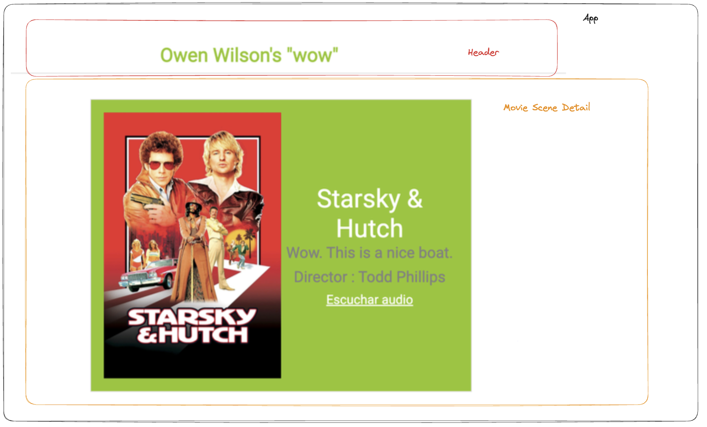

# Evaluación final módulo 3 
Bienvenida/o al ejercicio de evaluación final del módulo 3 de React js, hecho por [Silvia Torres](https://www.github.com/Storrecu)

## Objetivo:
El objetivo del ejercicio es crear una lista de tarjetas de películas, protagonizadas por el actor Owen Wilson. 
Estas películas, son aquellas en las que se recoge alguna frase que contiene la muletilla "wow" dicha por el actor.

## Desglose de componentes del proyecto: 

En este ejercicio se han dividido las tareas a realizar en 2 partes:

## Mínimo obligatorio: 

1. Hacer la petición a la API proporcionada.
2. Pintar la respuesta de la API en el HTML.
3. Crear una estructura básica de HTML que contenga una cabecera además del listado dinámico. 
4. Filtrar el listado buscando por nombre de la película y por el año de estreno de la misma.
5. Dividir la aplicación en componentes. Los componentes mínimos propuestos son: 
    - Componente para filtros.
    - Componente para el listado (MovieSceneList).
    - Componente para la tarjeta de cada película del listado (MovieSceneItem).
    - Componente para el detalle de cada escena del listado (MovieSceneDetail).
6. Añadir la funcionalidad de clickar en cada película y que se muestren los detalles de cada una, así como un fragmento de audio donde el actor dice su frase "wow". 
7. Añadir detalles de calidad tipo: 
    - Englobar la casilla de búsqueda en un formulario.
    - Evitar el comportamiento por defecto del formulario.
    - Mostrar un mensaje de error al usuario si su búsqueda no produce resultados.
    - La casilla de búsqueda, no discrimina mayúsculas o minúsculas.
    - Si estando en la ruta del detalle de una película quieres ir hacia atrás, el campo de texto debe mostrar el texto que buscó el usuario.

## Bonus:

5. Añadir mejoras visuales.
6. URL compatible: 
    - Si se navega a una URL inexistente debe mostrarse un mensaje de error.
    - La URL del detalle de cada película, puede compartirse.
    - Al refrescar la página estando en la ruta del detalle de la película, el navegador debe permanecer en esa ruta sin salirse, por medio del local storage.
7. Hacer que el listado de la película se muestre ordenado de forma alfabética.

## Visualización del proyecto: 
Puedes consultar y verificar todo esto pinchando en el enlace:

## Teconologías usadas: 

- HTML
- SCSS
- JavaScript
- React js + Vite
- React Starter Kit
- GitHub Pages

## Contribución: 
No dudes en hacerme un **pull request** con aquellos cambios o mejoras que creas que puedan encajar en este proyecto. 
Así mismo, no seas una persona tímida y **¡déjame tu feedback!**

**Gracias por el tiempo que has dedicado a revisar este ejercicio**

